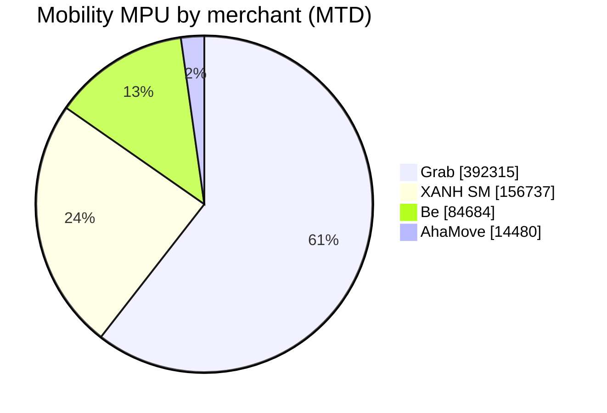
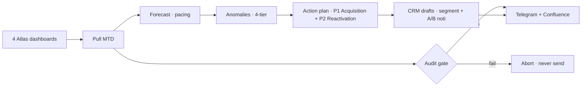

<div align="center">

# 🚀 Growth Assistant
### Your AI Growth Analyst for Zalopay Mobility

*From 4 messy dashboards to a decision — and the campaigns to act on it — every morning, in under 20 minutes.*


[](DEMO_VIDEO_URL)

</div>

---

## 💔 The 3-hour Monday problem
Every week, Zalopay Mobility's Growth Marketer burns **2–3 hours** copy-pasting numbers across **4 separate dashboards** (MBS · Grab · Be · XANH SM) just to answer one question:
> *"Are we on track this month — and what do we do about it?"*

By the time the analysis is done, half the day is gone — **before a single campaign is even built.**

## ✨ The 20-minute answer
Send one message in Telegram — **`/run`**. The agent reads all 4 dashboards, forecasts the month, spots what's slipping, and replies with a boardroom-ready brief **plus the exact CRM campaigns to fix it**. You review, tap **`/confirm`**, and the push-notification drafts land in the CRM — ready to publish.

> ### 🎯 It doesn't just tell you the problem. It hands you the solution, ready to send.

## 📈 The impact

<div align="center">

| ⏱️ Faster | 🎯 Trustworthy | 🚀 Actionable |
|:---:|:---:|:---:|
| **2–3 hrs → under 20 min** | **100% traced to live data** | **Insight → ready-to-send campaigns** |
| weekly analysis, automated | audit-gated · zero fabrication | not just a report |

</div>

## 🌓 A morning, before & after

| Step | 😩 Before | 😎 With Growth Assistant |
|------|-----------|--------------------------|
| Pull the data | manual, 4 browser tabs, ~1h | automatic, in seconds |
| Forecast & risk | spreadsheet guesswork | pacing model + 4-tier alerts |
| Find the lever | scroll & eyeball | named, prioritized actions |
| Build campaigns | from scratch | drafted in CRM, 1-tap publish |

## 👀 What lands in your chat every morning

> 🟡 **AT RISK** — MPU **548,636** → forecast **95.1%** of target
> Gap is **acquisition** (new users flat); lever = re-engage lapsed riders.

A clean executive brief: **Verdict · MTD Snapshot · Segment Health · Top Anomalies · Action Plan · CRM-Ready** — written for a marketer, not a data engineer.

## 🧭 Where the revenue is (the agent prioritizes automatically)


→ It focuses reactivation on **Grab & XANH SM** because that's where the paying users are.

## 🎬 From insight to action — campaigns ready to publish
Four push-notification drafts with **real deeplinks + A/B copy**, staged in the CRM as **DRAFT** (you approve & publish — the agent never sends on its own):

| Campaign | Goal | One-tap opens |
|----------|------|---------------|
| 🟢 Grab — Reactivation | win back lapsed riders | Grab in Zalopay |
| 🔵 First Ride — Acquisition | convert new users | Ride hub |
| 🟡 XANH SM — Reactivation | win back lapsed riders | XANH SM mini-app |
| 🟠 Be — Reactivation | win back lapsed riders | Be in Zalopay |

## 🔒 Why you can trust it
- **Every number is pulled live and audited** — if anything doesn't reconcile, the agent *refuses to send*. No made-up figures, ever.
- **The agent never publishes on its own** — it proposes & drafts; a human reviews and activates.

## ⚙️ Two ways it works

<div align="center">

| 🕙 **Daily · 10:00** | 💬 **On command** |
|:---:|:---:|
| runs automatically | chat `/run` in Telegram |
| posts the brief to Telegram + Confluence | review → `/confirm` → drafts in CRM |

</div>

---

<details>
<summary><b>🔧 Under the hood</b> — for the engineers (click to expand)</summary>

### How it thinks


### Stack


The bot **self-sources its own CRM session** (no manual token) and stages noti as DRAFT, replying with the exact content embedded (title · body · deeplinks).

### Layout
| Path | Purpose |
|------|---------|
| `mbs_growth.py` | Pipeline: pull → forecast → anomaly → report → deliver |
| `crm_noti.py` | Action engine + CRM segment/noti generator (draft-only) |
| `crm_client.py` | Full-auto CRM staging — self-sources its own session |
| `telegram_bot.py` | `/run` + `/confirm` bridge (HTML, chunked) |
| `app.py` | FastAPI endpoint agent (AgentBase Custom Agent) |
| `tests/` | 47 tests · see `DEMO_SCRIPT.md`, `DEPLOY_RUNBOOK.md` |

### Run
```bash
./run_mbs_growth.sh          # auto-login → pull → audit → post
python3 -m pytest tests/     # 47 tests passing
```
</details>

<div align="center"><sub>Built on <b>GreenNode AgentBase + MaaS</b> · Brand spelled <b>Zalopay</b> · Team <b>Summer Lubu</b></sub></div>
