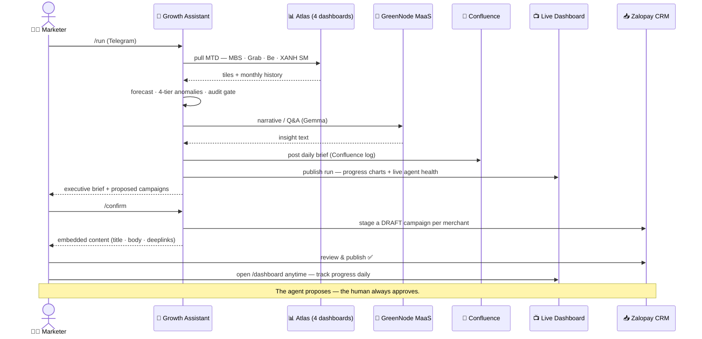
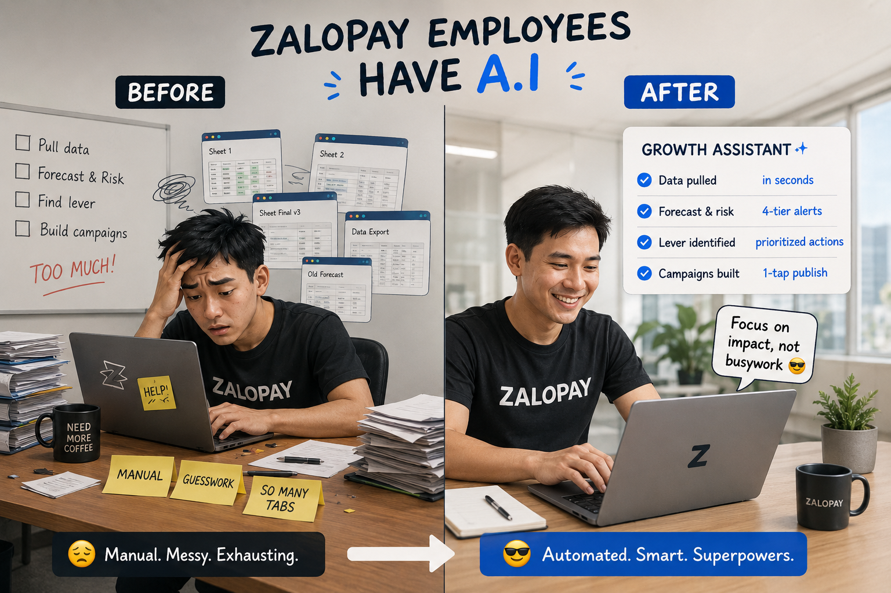
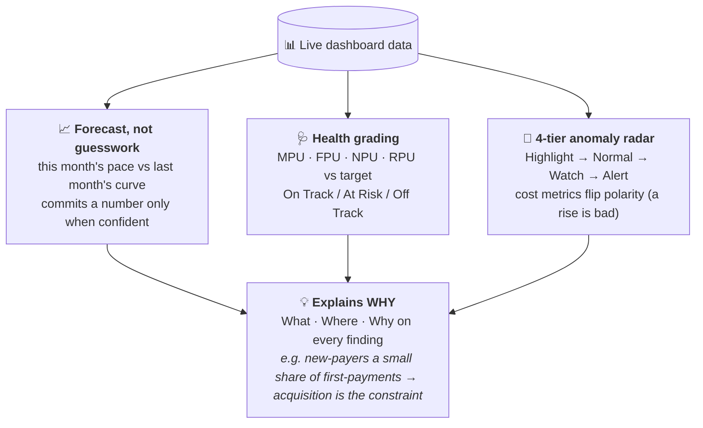
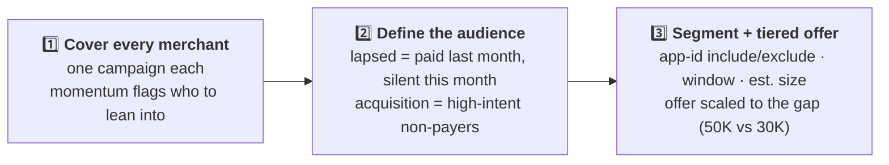
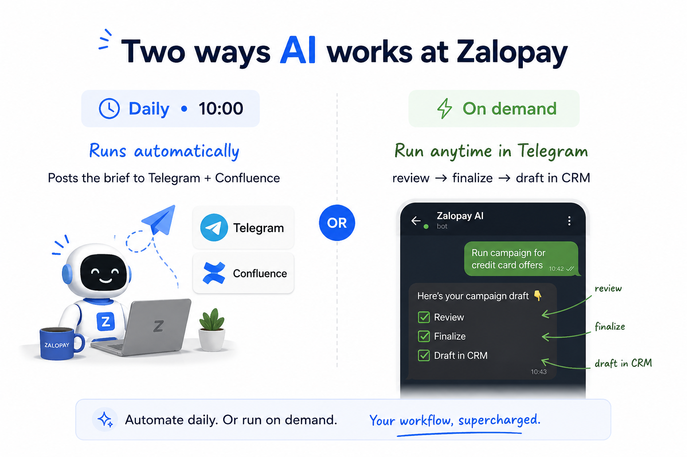
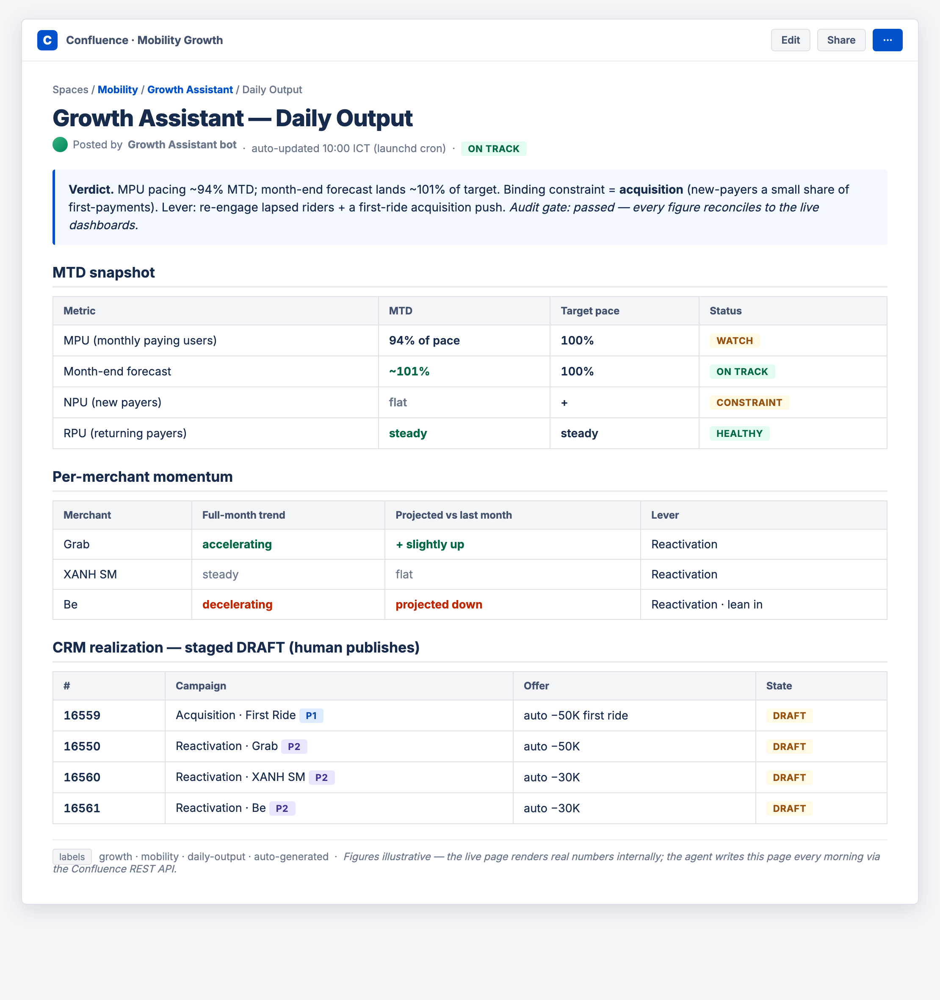
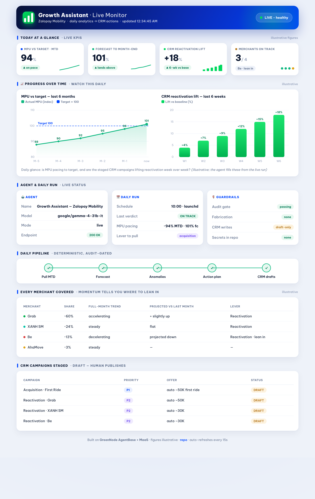
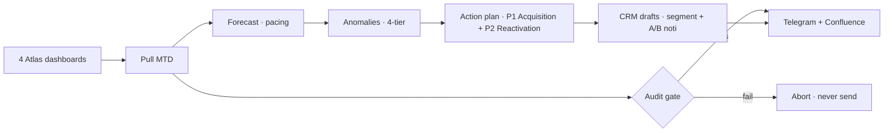

<div align="center">


# 🚀 Growth Assistant
### Your AI Growth Analyst for Zalopay Mobility

[](https://github.com/thai-max-nguyen/claw-a-thon-demo-agent-mvp)


[](https://endpoint-4718fb93-6ff0-48fb-8723-f999e547970a.agentbase-runtime.aiplatform.vngcloud.vn/dashboard)


[](https://vngms-my.sharepoint.com/:f:/g/personal/khailt_vng_com_vn/IgCTlgAV8wZbRqKThgshpnFaAYrSFh-8P-mibf8jWZVlnBM?e=q9X2Ca)

### ⭐ Like it? Give us a **star** and a **vote** — *Team Summer Lubu* 💜

</div>

---

## 💔 The 3-hour Monday problem


Every week, Zalopay Mobility's Growth Marketer burns **2–3 hours** copy-pasting numbers across **4 separate dashboards** (MBS · Grab · Be · XANH SM) just to answer one question:
> *"Are we on track this month — and what do we do about it?"*

By the time the analysis is done, half the day is gone — **before a single campaign is even built.**

## ✨ The 20-minute answer
Send one message in Telegram — **`/run`**. The agent reads all 4 dashboards, forecasts the month, spots what's slipping, and replies with a boardroom-ready brief **plus the exact CRM campaigns to fix it**. You review, tap **`/confirm`**, and the push-notification drafts land in the CRM — ready to publish.

> ### 🎯 It doesn't just tell you the problem. It hands you the solution, ready to send.



→ The **📺 Live Dashboard** above is a real endpoint the agent serves — [**open `/dashboard`**](https://endpoint-4718fb93-6ff0-48fb-8723-f999e547970a.agentbase-runtime.aiplatform.vngcloud.vn/dashboard) to watch the same flow: MPU-vs-target + CRM-lift progress charts, live agent health, and staged campaigns.

## 🎥 See it in action

**Step 1 — `/run`: one message, and the full analysis lands in Telegram**


**Step 2 — `/confirm`: review the plan, then stage the campaigns as DRAFT (with the exact content embedded)**


**Step 3 — Live in the Zalopay CRM: the campaigns are staged, ready for a human to review & publish**


## 📈 The impact

<div align="center">

| ⏱️ Faster | 🎯 Trustworthy | 🚀 Actionable |
|:---:|:---:|:---:|
| **2–3 hrs → under 20 min** | **100% traced to live data** | **Insight → ready-to-send campaigns** |
| weekly analysis, automated | audit-gated · zero fabrication | not just a report |

</div>

## 🌓 A morning, before & after



| Step | 😩 Before | 😎 With Growth Assistant |
|------|-----------|--------------------------|
| Pull the data | manual, 4 browser tabs, ~1h | automatic, in seconds |
| Forecast & risk | spreadsheet guesswork | pacing model + 4-tier alerts |
| Find the lever | scroll & eyeball | named, prioritized actions |
| Build campaigns | from scratch | drafted in CRM, 1-tap publish |

## 👀 What lands in your chat every morning

> 🟡 **AT RISK** — MPU pacing to **~95% of target** · gap is **acquisition** (new users flat) → re-engage lapsed riders.

A clean executive brief: **Verdict · MTD Snapshot · Segment Health · Top Anomalies · Action Plan · CRM-Ready** — written for a marketer, not a data engineer.

> 📊 *All figures in this README are **illustrative**. The agent runs on the live Zalopay Mobility dashboards — real business numbers stay internal.*

## 🧠 The analysis behind it (not a dumb export)
The agent thinks like a senior growth analyst — every output traces back to live data:



**It also *combines* the dashboards into signals none of them show on their own** (real, computed from the pulls — no fabrication):
- **Per-merchant momentum + forecast** — the `YTM` monthly history → each merchant's MoM trend (accelerating / decelerating) and its own month-end projection, not just today's size.
- **Funnel-leak diagnosis** — NPU → FPU → RPU ratios → pinpoints the binding stage (*acquisition vs retention*) so it picks the right lever.
- **Spend efficiency** — Discount ÷ TPV + refund rate per merchant → avoid pushing budget where it bleeds.

### 🎯 How it picks the segment to target
A 3-step funnel from "where's the money" to a ready CRM audience:



## 🧭 Every merchant gets a campaign — momentum tells you where to lean in

The agent builds a tailored campaign for **all four merchants** — then reads each one's **live momentum** to decide *where to lean in*. A slipping merchant gets a stronger nudge; a healthy one a lighter touch. **Grow every merchant, not just the big ones.**

| Merchant | Momentum (live) | Campaign | Nudge strength |
|----------|-----------------|----------|----------------|
| 🟢 Grab | accelerating | Reactivation | lighter touch |
| 🔵 XANH SM | steady | Reactivation | standard |
| 🔴 Be | **decelerating** | Reactivation | **lean in — stronger** |
| 🟡 AhaMove | steady | covered | standard |

*→ Coverage is universal; intensity is data-driven. (momentum computed live from each merchant's monthly history — values illustrative.)*

## 🎬 From insight to action — campaigns ready to publish
Four push-notification drafts with **real deeplinks + A/B copy**, staged in the CRM as **DRAFT** (you approve & publish — the agent never sends on its own):

| Campaign | Goal | One-tap opens |
|----------|------|---------------|
| 🟢 Grab — Reactivation | win back lapsed riders | Grab in Zalopay |
| 🔵 First Ride — Acquisition | convert new users | Ride hub |
| 🟡 XANH SM — Reactivation | win back lapsed riders | XANH SM mini-app |
| 🟠 Be — Reactivation | win back lapsed riders | Be in Zalopay |

**And it writes the copy, too** — each campaign ships with A/B push content + send time + the hypothesis being tested:
> **A · Value** — *"Đặt xe tháng này — Zalopay giảm đến 50K"*
> "Thanh toán Grab bằng Zalopay, chuyến này tiết kiệm đến 50K. Đặt xe thôi!" — send 11:30 SA
> **B · Personalized** — *"{first_name}, tháng này chưa đặt xe?"* — send 6:00 CH
> *Hypothesis: personal recall lifts open-rate on lapsed riders.*

## 🔒 Why you can trust it
- **Every number is pulled live and audited** — if anything doesn't reconcile, the agent *refuses to send*. No made-up figures, ever.
- **The agent never publishes on its own** — it proposes & drafts; a human reviews and activates.

## ⚙️ Two ways it works



<div align="center">

| 🕙 **Daily · 10:00** | 💬 **On command** |
|:---:|:---:|
| runs automatically | chat `/run` in Telegram |
| posts the brief to Telegram + Confluence | review → `/confirm` → drafts in CRM |

</div>

### 📄 The daily brief, auto-logged to Confluence
At 10:00 every morning the agent writes its full brief to a Confluence page (REST API) — verdict, MTD snapshot, per-merchant momentum, and the CRM campaigns it staged — so the whole team has one living source of truth, no one has to run anything.



> 📊 *Figures illustrative — the live page renders real numbers internally.*

## 📺 Live monitoring dashboard
Beyond the daily brief, the agent serves a **live monitoring dashboard** — agent health + model polled in real time, plus an at-a-glance view of the daily run, pipeline, per-merchant momentum, and staged CRM campaigns. On-brand (Zalopay blue/green), auto-refreshing.



▶️ **Live:** [`/dashboard`](https://endpoint-4718fb93-6ff0-48fb-8723-f999e547970a.agentbase-runtime.aiplatform.vngcloud.vn/dashboard) on the deployed AgentBase endpoint.

## 🔌 Integrations & setup
Growth Assistant plugs into the tools the team already uses — each via its own auth, and **no data leaves your stack**:

| Tool | Used for | How it connects | You provide |
|------|----------|-----------------|-------------|
| **GreenNode MaaS** | the agent's LLM (Q&A, narrative) | OpenAI-compatible API | `LLM_API_KEY` · `LLM_MODEL` (`google/gemma-4-31b-it`) |
| **GreenNode AgentBase** | hosts the agent (container runtime) | IAM service account + Container Registry | `GREENNODE_CLIENT_ID` / `_SECRET` *(deploy only)* |
| **Atlas (Tableau)** | reads the 4 MBS dashboards | VizQL bootstrap over your SSO session | a logged-in Atlas session *(auto-login script)* |
| **Telegram** | `/run` + `/confirm` + report delivery | Bot API (long-poll) | `TELEGRAM_BOT_TOKEN` · `TELEGRAM_GROUP_ID` |
| **Confluence** | daily-log + PRD pages | REST API | `~/.config/confluence-token` |
| **Zalopay CRM** | stages DRAFT push-noti | `office.zalopay.vn` API — the bot **self-sources its session** from the logged-in browser | just be logged into the CRM tool |

**Quick start (local):**
```bash
cp .env.example .env         # fill: LLM_API_KEY, TELEGRAM_BOT_TOKEN, TELEGRAM_GROUP_ID
./run_mbs_growth.sh          # Atlas auto-login → pull → audit → post (Telegram + Confluence)
python3 telegram_bot.py      # start the /run + /confirm bot
python3 -m pytest tests/     # 56 tests
```
> 🔐 **No secret is ever committed** — every credential is env-injected or read in-memory; `.env`, tokens, and registry creds are gitignored. `.env.example` is the tracked template.

## 🟢 Powered by GreenNode
Growth Assistant runs end-to-end on the **GreenNode AI Platform**:

- **AgentBase** — the agent ships as a containerized **Custom Agent** runtime (`/health` + `/chat`), deployed straight from GreenNode's Container Registry.
- **MaaS (Model-as-a-Service)** — one OpenAI-compatible endpoint to GreenNode's model catalog. The agent is **model-agnostic**: each role (question / narrative / scoring) can be pinned to its own model via env, all defaulting to one configured model — so you can scale model choice up without touching code.
- **Token-efficient by design** — the heavy lifting (metrics, pacing forecast, anomaly math) is deterministic Python over dashboard data, so **LLM tokens are spent only where they add value** (narrative + Q&A). Lower cost, faster replies — and an **audit gate** guarantees correctness no matter the model.
- **Live now** — deployed as an AgentBase Custom Agent running **`google/gemma-4-31b-it`** (a GreenNode-enabled model, chosen for token efficiency + strong Vietnamese output). Public endpoint, `/health` → `200`.

> 🙏 **Thank you, GreenNode** — for the AgentBase + MaaS infrastructure and for powering Claw-a-thon 2026. 💚

## 🗺️ What's next
Today the agent is dashboard-bound — it only claims what the dashboards can prove. As the data layer grows, so does the depth:

| Phase | Upgrade | Unlocks |
|-------|---------|---------|
| **Now** | Dashboard-only analysis + draft CRM campaigns | MTD forecast, anomaly radar, per-merchant reactivation |
| **Next — when ZDS dashboards support segment filters** | Split NPU / RPU / RSPU **by merchant**, per-merchant forecast | sharper targeting + budget allocation per merchant |
| **Then** | **Gradual, staged auto-rollout** for large high-risk user sets | safely roll out to big audiences |
| **Then** | One-tap **live publish** (agent → CRM) once write-scope is granted | close the loop end-to-end |
| **Later** | More channels (Zalo OA, in-app) + more verticals beyond Mobility | one analyst brain across the business |

---

<details>
<summary><b>🔧 Under the hood</b> — for the engineers (click to expand)</summary>

### How it thinks


### Stack


The bot **self-sources its own CRM session** (no manual token) and stages noti as DRAFT, replying with the exact content embedded (title · body · deeplinks).

### Layout
| Path | Purpose |
|------|---------|
| `mbs_growth.py` | Pipeline: pull → forecast → anomaly → report → deliver |
| `crm_noti.py` | Action engine + CRM segment/noti generator (draft-only) |
| `crm_client.py` | Full-auto CRM staging — self-sources its own session |
| `telegram_bot.py` | `/run` + `/confirm` bridge (HTML, chunked) |
| `app.py` | FastAPI endpoint agent (AgentBase Custom Agent) |
| `tests/` | 56 tests · see `DEMO_SCRIPT.md` |

### Run
```bash
./run_mbs_growth.sh          # auto-login → pull → audit → post
python3 -m pytest tests/     # 56 tests passing
```
</details>

<div align="center">

### ⭐ If this made you go "wow" — drop a star and a vote for **Team Summer Lubu** 💜

<sub>Built on <b>GreenNode AgentBase + MaaS</b> · Brand spelled <b>Zalopay</b> · Team <b>Summer Lubu</b></sub>

</div>


