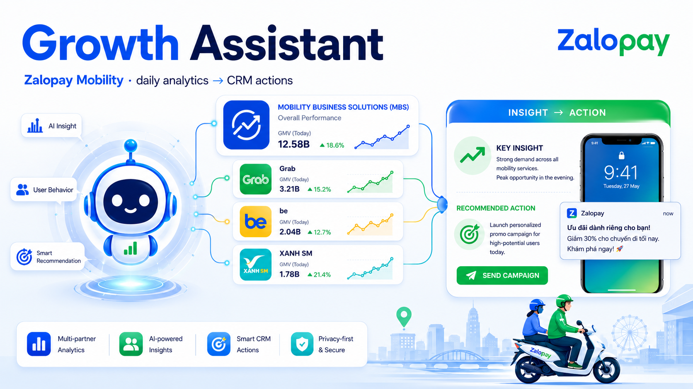
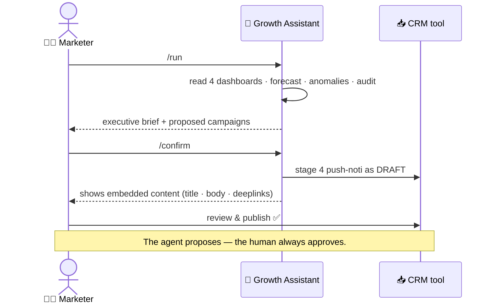
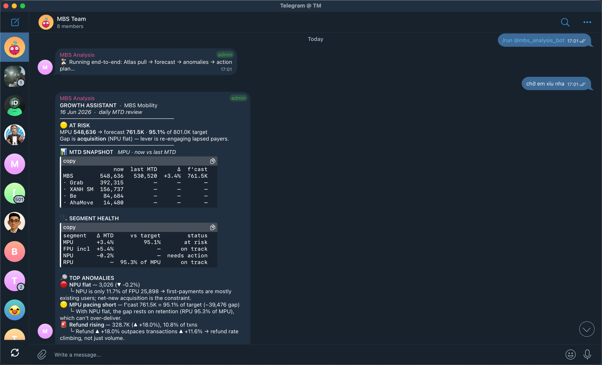
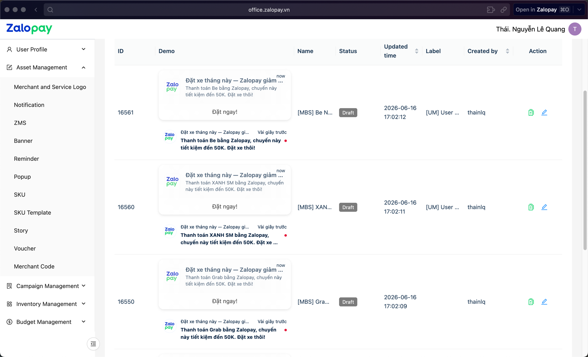
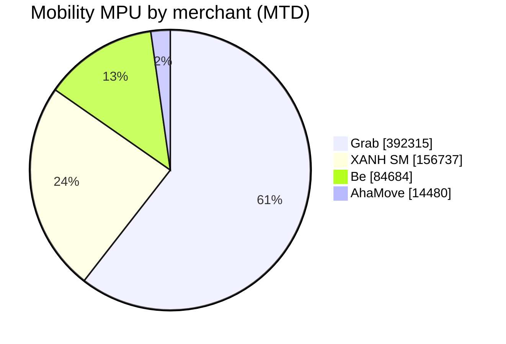
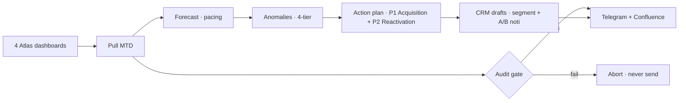

<div align="center">



# 🚀 Growth Assistant
### Your AI Growth Analyst for Zalopay Mobility

[](https://github.com/thai-max-nguyen/claw-a-thon-demo-agent-mvp)


[](DEMO_VIDEO_URL)

### ⭐ Like it? Give us a **star** and a **vote** — *Team Summer Lubu* 💜

</div>

---

## 💔 The 3-hour Monday problem
Every week, Zalopay Mobility's Growth Marketer burns **2–3 hours** copy-pasting numbers across **4 separate dashboards** (MBS · Grab · Be · XANH SM) just to answer one question:
> *"Are we on track this month — and what do we do about it?"*

By the time the analysis is done, half the day is gone — **before a single campaign is even built.**

## ✨ The 20-minute answer
Send one message in Telegram — **`/run`**. The agent reads all 4 dashboards, forecasts the month, spots what's slipping, and replies with a boardroom-ready brief **plus the exact CRM campaigns to fix it**. You review, tap **`/confirm`**, and the push-notification drafts land in the CRM — ready to publish.

> ### 🎯 It doesn't just tell you the problem. It hands you the solution, ready to send.



## 🎥 See it in action

**1️⃣ `/run` — one message, full analysis lands in Telegram**


**2️⃣ `/confirm` — campaigns staged as DRAFT, with the exact content embedded**


**3️⃣ Live in the Zalopay CRM — ready for a human to review & publish**


## 📈 The impact

<div align="center">

| ⏱️ Faster | 🎯 Trustworthy | 🚀 Actionable |
|:---:|:---:|:---:|
| **2–3 hrs → under 20 min** | **100% traced to live data** | **Insight → ready-to-send campaigns** |
| weekly analysis, automated | audit-gated · zero fabrication | not just a report |

</div>

## 🌓 A morning, before & after

| Step | 😩 Before | 😎 With Growth Assistant |
|------|-----------|--------------------------|
| Pull the data | manual, 4 browser tabs, ~1h | automatic, in seconds |
| Forecast & risk | spreadsheet guesswork | pacing model + 4-tier alerts |
| Find the lever | scroll & eyeball | named, prioritized actions |
| Build campaigns | from scratch | drafted in CRM, 1-tap publish |

## 👀 What lands in your chat every morning

> 🟡 **AT RISK** — MPU **548,636** → forecast **95.1%** of target
> Gap is **acquisition** (new users flat); lever = re-engage lapsed riders.

A clean executive brief: **Verdict · MTD Snapshot · Segment Health · Top Anomalies · Action Plan · CRM-Ready** — written for a marketer, not a data engineer.

## 🧠 The analysis behind it (not a dumb export)
The agent thinks like a senior growth analyst:

- **Forecast, not guesswork** — it compares this month's *daily pace* against last month's full curve to project end-of-month MPU, and only commits a number when confidence is high.
- **Health grading** — every segment (MPU · FPU · NPU · RPU) is scored against the monthly target → **On Track / At Risk / Off Track**.
- **4-tier anomaly radar** — changes are auto-classified *Highlight → Normal → Watch → Alert*; cost metrics like refund flip polarity (a rise is bad), so nothing slips through.
- **It explains *why*** — each anomaly comes with What / Where / Why, e.g. *"NPU is only 11.7% of FPU → first-payments are mostly existing users, so net-new acquisition is the real constraint."*

### 🎯 How it picks the segment to target
1. **Rank by impact** — merchants sorted by MPU share; the biggest pools (Grab, XANH SM) get the first reactivation push.
2. **Define the audience precisely** — *lapsed payer* = paid at this merchant **last month**, silent **this month**; *acquisition* = high-intent users with no Mobility payment yet.
3. **Translate to a CRM segment** — app-id include/exclude, time window, estimated size, 1 promo/user — ready to drop into the tool.

## 🧭 Where the revenue is (the agent prioritizes automatically)


→ It focuses reactivation on **Grab & XANH SM** because that's where the paying users are.

## 🎬 From insight to action — campaigns ready to publish
Four push-notification drafts with **real deeplinks + A/B copy**, staged in the CRM as **DRAFT** (you approve & publish — the agent never sends on its own):

| Campaign | Goal | One-tap opens |
|----------|------|---------------|
| 🟢 Grab — Reactivation | win back lapsed riders | Grab in Zalopay |
| 🔵 First Ride — Acquisition | convert new users | Ride hub |
| 🟡 XANH SM — Reactivation | win back lapsed riders | XANH SM mini-app |
| 🟠 Be — Reactivation | win back lapsed riders | Be in Zalopay |

**And it writes the copy, too** — each campaign ships with A/B push content + send time + the hypothesis being tested:
> **A · Value** — *"Đặt xe tháng này — Zalopay giảm đến 50K"*
> "Thanh toán Grab bằng Zalopay, chuyến này tiết kiệm đến 50K. Đặt xe thôi!" — send 11:30 SA
> **B · Personalized** — *"{first_name}, tháng này chưa đặt xe?"* — send 6:00 CH
> *Hypothesis: personal recall lifts open-rate on lapsed riders.*

## 🔒 Why you can trust it
- **Every number is pulled live and audited** — if anything doesn't reconcile, the agent *refuses to send*. No made-up figures, ever.
- **The agent never publishes on its own** — it proposes & drafts; a human reviews and activates.

## ⚙️ Two ways it works

<div align="center">

| 🕙 **Daily · 10:00** | 💬 **On command** |
|:---:|:---:|
| runs automatically | chat `/run` in Telegram |
| posts the brief to Telegram + Confluence | review → `/confirm` → drafts in CRM |

</div>

## 🟢 Powered by GreenNode
Growth Assistant runs end-to-end on the **GreenNode AI Platform**:

- **AgentBase** — the agent ships as a containerized **Custom Agent** runtime (`/health` + `/chat`), deployed straight from GreenNode's Container Registry.
- **MaaS (Model-as-a-Service)** — one OpenAI-compatible endpoint to top models (**GPT · Gemini · Qwen**). The agent **pins the right model per task** — a fast model for generation, a reasoning model for scoring/analysis — instead of one-size-fits-all.
- **Token-efficient by design** — the heavy lifting (metrics, pacing forecast, anomaly math) is deterministic Python over dashboard data, so **LLM tokens are spent only where they add value** (narrative + Q&A). Lower cost, faster replies — and an **audit gate** guarantees correctness no matter the model.

> 🙏 **Thank you, GreenNode** — for the AgentBase + MaaS infrastructure and for powering Claw-a-thon 2026. 💚

## 🗺️ What's next
Today the agent is dashboard-bound — it only claims what the dashboards can prove. As the data layer grows, so does the depth:

| Phase | Upgrade | Unlocks |
|-------|---------|---------|
| **Now** | Dashboard-only analysis + draft CRM campaigns | MTD forecast, anomaly radar, per-merchant reactivation |
| **Next — when ZDS dashboards support segment filters** | Split NPU / RPU / RSPU **by merchant**, per-merchant forecast | sharper targeting + budget allocation per merchant |
| **Then** | **Toro-style auto-rollout** for large high-risk UID sets | safe staged rollout to big audiences |
| **Then** | One-tap **live publish** (agent → CRM) once write-scope is granted | close the loop end-to-end |
| **Later** | More channels (Zalo OA, in-app) + more verticals beyond Mobility | one analyst brain across the business |

---

<details>
<summary><b>🔧 Under the hood</b> — for the engineers (click to expand)</summary>

### How it thinks


### Stack


The bot **self-sources its own CRM session** (no manual token) and stages noti as DRAFT, replying with the exact content embedded (title · body · deeplinks).

### Layout
| Path | Purpose |
|------|---------|
| `mbs_growth.py` | Pipeline: pull → forecast → anomaly → report → deliver |
| `crm_noti.py` | Action engine + CRM segment/noti generator (draft-only) |
| `crm_client.py` | Full-auto CRM staging — self-sources its own session |
| `telegram_bot.py` | `/run` + `/confirm` bridge (HTML, chunked) |
| `app.py` | FastAPI endpoint agent (AgentBase Custom Agent) |
| `tests/` | 47 tests · see `DEMO_SCRIPT.md`, `DEPLOY_RUNBOOK.md` |

### Run
```bash
./run_mbs_growth.sh          # auto-login → pull → audit → post
python3 -m pytest tests/     # 47 tests passing
```
</details>

<div align="center">

### ⭐ If this made you go "wow" — drop a star and a vote for **Team Summer Lubu** 💜

<sub>Built on <b>GreenNode AgentBase + MaaS</b> · Brand spelled <b>Zalopay</b> · Team <b>Summer Lubu</b></sub>

</div>


