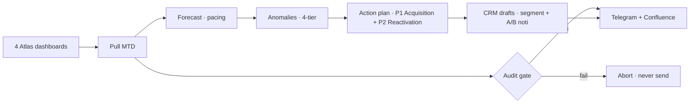

<div align="center">

# 🚀 Growth Assistant — Zalopay Mobility Services

**An AI growth analyst that turns 4 raw dashboards into a daily decision + ready-to-publish CRM campaigns — in under 20 minutes.**


</div>

---

## 🎯 The problem
Zalopay Mobility's Growth Marketer spends **2–3 hours every week** manually stitching numbers across **4 disconnected Atlas dashboards** (MBS · Grab · Be · XANH SM) — computing metrics, forecasting the month, hunting under-performing segments — *before even touching* CRM push notifications.

## 🤖 The agent
Reads the dashboards directly (no Excel), forecasts the full month, flags anomalies, and returns a prioritized **action plan + the CRM assets to execute it** — draft-only, human-approved. The team spends time on decisions, not data wrangling.

## ⚙️ Two ways it runs
| Mode | Trigger | What happens |
|------|---------|--------------|
| 🕙 **Daily** | `launchd` @ 10:00 (Atlas auto-login, self-heals SSO) | Full pipeline → posts the executive report to **Telegram + Confluence** daily log |
| 💬 **On command** | Telegram `/run` → review → `/confirm` | Same pipeline on demand. `/confirm` stages the CRM noti as **DRAFT** — the bot **self-sources its own CRM session** (no manual token) and replies with the exact content embedded (title · body · deeplinks) |

## 🔭 Pipeline


## 📊 What it produces
An **executive report**: `Verdict → MTD Snapshot → Segment Health → Top Anomalies (3W) → Action Plan → CRM-Ready`.
> e.g. **MPU 548,636 → forecast 95.1% of target · 🟡 At Risk** — gap is acquisition (NPU flat); lever = re-engage lapsed payers.

## 📥 CRM realization (live, draft-only)
The action plan ships as **DRAFT** notifications in the Zalopay CRM tool — real per-merchant deeplinks + A/B copy, ready for a human to review & publish.

| Campaign | Type | Deeplink |
|----------|------|----------|
| Grab | Reactivation | `zalopay://launch/app/2222` |
| First Ride | Acquisition | `zalopay://launch/app/2222` |
| XANH SM | Reactivation | `zalopay://launch/app/1653?id=6944` |
| Be | Reactivation | `zalopay://launch/app/1341` |

## 🛡️ Guardrails
- **Audit gate** validates every number (segment sums, forecast bounds, cross-checks) and **aborts before sending** if anything fails — *nothing fabricated*.
- **Draft-only** — the agent proposes & embeds content; a human publishes.
- **No secrets in the repo** — credentials are env-injected / gitignored.

## 🧱 Stack
GreenNode **AgentBase** (Custom Agent · `app.py`) · **MaaS** LLM · FastAPI · Atlas (Tableau) VizQL · Telegram · Confluence.

## 🗂️ Layout
| Path | Purpose |
|------|---------|
| `mbs_growth.py` | Pipeline: pull → forecast → anomaly → report → deliver |
| `crm_noti.py` | Action engine + CRM segment/noti generator (draft-only) |
| `crm_client.py` | Full-auto CRM staging — self-sources its own session |
| `telegram_bot.py` | `/run` + `/confirm` bridge (HTML, chunked) |
| `app.py` | FastAPI endpoint agent (AgentBase Custom Agent) |
| `run_mbs_growth.sh` | Daily wrapper (Atlas auto-login + run) |
| `tests/` | 47 tests · `DEMO_SCRIPT.md` · `DEPLOY_RUNBOOK.md` |

## ▶️ Run
```bash
./run_mbs_growth.sh          # auto-login → pull → audit → post (Telegram + Confluence)
python3 -m pytest tests/     # 47 tests
```

<div align="center"><sub>Built on GreenNode AgentBase + MaaS · Brand spelled <b>Zalopay</b> · Team Summer Lubu</sub></div>
